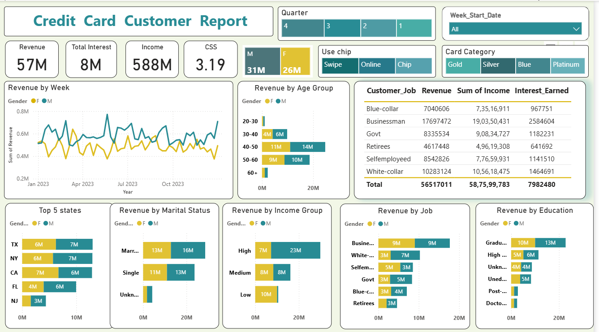
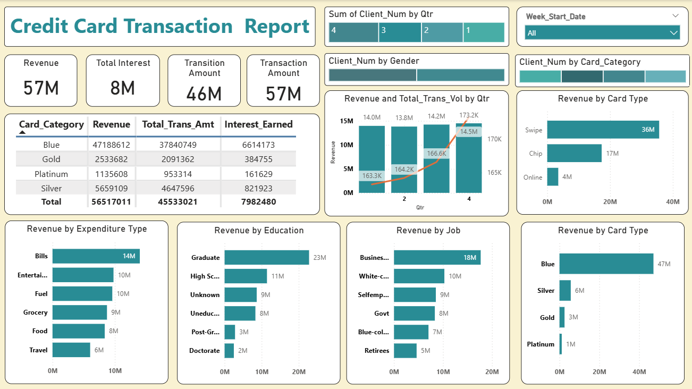

# 📊 Credit Card Financial Dashboard using Power BI

## 📖 Table of Contents
1. 📝 Project Title & Description
2. 🎯 Problem Statement / Objective
3. 💾 Data Details
4. ⚙️ Steps Performed
5. 📐 DAX Queries
6. 📸 Dashboard Screenshots]
7. 💡 Key Insights / Findings
8. 🛠️ Tools & Technologies Used
9. 🚀 Future Work / Improvements

---

## 📝 1. Project Title & Description

**Project Name:** Credit Card Transaction & Customer Analysis  

**Summary:**  
This project analyzes customer spending patterns and credit card transactions, and builds interactive dashboards for actionable insights.  

**Key Highlights:**  
- Developed an interactive Power BI dashboard using transaction and customer data from a SQL database.  
- Streamlined data processing and analysis to monitor key performance metrics and trends.  
- Shared actionable insights with stakeholders to support data-driven decision-making.

---

## 🎯 2. Problem Statement / Objective

To develop a comprehensive weekly credit card dashboard providing real-time insights into key performance metrics and trends, enabling stakeholders to monitor and analyze credit card operations effectively.

---

## 💾 3. Data Details

**Source of Dataset:**  
The dataset is from a YouTube tutorial/project on credit card transactions and customer analysis. It contains customer demographics, transaction details, and spending behavior. Since this is a practice project, the dataset is not real.  

**Tables and Size:**  
- **Customer Table:** 10,293 rows × 17 columns  
- **Credit Card Table:** 10,293 rows × 20 columns  

---

## ⚙️ 4. Steps Performed

1. Data Cleaning & Preprocessing  
2. Exploratory Data Analysis (EDA)  
3. Created DAX Calculated Columns & Measures  
4. Used SQL queries (uploaded in the repository)  
5. Built Power BI dashboards  
6. Extracted key insights for stakeholders  

---

## 📐 5. DAX Queries

**1. Age Group Calculated Column**
```DAX
AgeGroup = SWITCH(
    TRUE(),
    'public cust_detail'[customer_age] < 30, "20-30",
    'public cust_detail'[customer_age] >= 30 && 'public cust_detail'[customer_age] < 40, "30-40",
    'public cust_detail'[customer_age] >= 40 && 'public cust_detail'[customer_age] < 50, "40-50",
    'public cust_detail'[customer_age] >= 50 && 'public cust_detail'[customer_age] < 60, "50-60",
    'public cust_detail'[customer_age] >= 60, "60+",
    "unknown"
)

**2. Income Group Calculated Column
```DAX
IncomeGroup = SWITCH(
    TRUE(),
    'public cust_detail'[income] < 35000, "Low",
    'public cust_detail'[income] >= 35000 && 'public cust_detail'[income] <70000, "Med",
    'public cust_detail'[income] >= 70000, "High",
    "unknown"
)

3. Week Number Calculated Column
```DAX
week_num2 = WEEKNUM('public cc_detail'[week_start_date])

4. Revenue Calculated Column
```DAX
Revenue = 'public cc_detail'[annual_fees] + 'public cc_detail'[total_trans_amt] + 'public cc_detail'[interest_earned]

5. Current Week Revenue Measure
```DAX
Current_week_revenue = CALCULATE(
    SUM(credit_card[Revenue]),
    FILTER(ALL(credit_card), credit_card[Week_num2] = MAX(credit_card[Week_num2]))
)

6. Previous Week Revenue Measure
```DAX
Previous_week_revenue = CALCULATE(
    SUM(credit_card[Revenue]),
    FILTER(ALL(credit_card), credit_card[Week_num2] = MAX(credit_card[Week_num2])-1)
)

7. WoW Revenue Ratio Measure
```DAX
wow_revenue_ratio = DIVIDE(
    (credit_card[Current_week_revenue] - credit_card[Previous_week_revenue]),
    credit_card[Previous_week_revenue]
)
📸 6. Dashboard Screenshots
### Credit Card Customer Analysis Dashboard



### Credit Card Transaction Dashboard




💡 7. Key Insights / Findings (Week 53 - 31st Dec)

WoW Change:

Revenue increased by 28.8%

Total Transaction Amount increased by 262,331 (35.04% increase compared to previous week)

Customers increased from 124 → 185 (49.19% increase)

Overview YTD (Year To Date):

Overall revenue: 57M

Total interest: 8M

Total transaction amount: 46M

Male customers contributed 31M, female 26M

Blue & Silver credit cards contributed 93% of overall transactions

TX, NY & CA contributed 68% of overall transactions

Overall Activation rate: 57.5%

Overall Delinquent rate: 6.06%

🛠️ 8. Tools & Technologies Used

SQL

Power BI

Excel

🚀 9. Future Work / Improvements

Add predictive modeling for churn and fraud detection
Incorporate more granular customer segmentation


