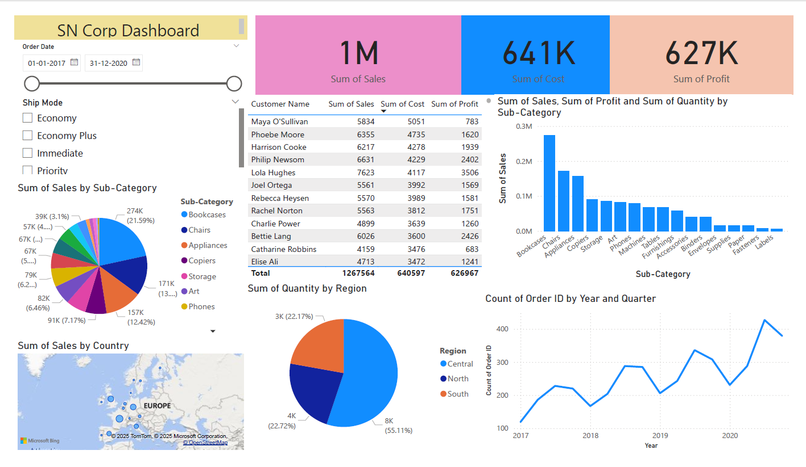

📊 SN Corp Dashboard
📌 About

This project is my first Power BI dashboard created while learning data visualization. It uses the SN Corp dataset (from a Power BI workshop) to analyze sales, profit, customers, and product performance across different regions and categories.

🗂 Dataset

Name: SN Corp Dataset

Contents: Orders with details such as Order ID, Customer, City, Country, Region, Segment, Ship Mode, Category, Sales, Profit, and Quantity.

Use: Practicing dashboard creation, filters, slicers, and visualization techniques in Power BI.

📊 Dashboard Highlights

Sales and Profit overview

Category & Sub-category analysis

Regional and Segment performance

Customer-level insights

Interactive filters for exploring data

🖼 Dashboard Preview

⚙️ How to View

Download the SN Corp Dashboard.pbix file from this folder.

Open it with Power BI Desktop (free to install).

Explore the interactive dashboard.

🔮 Future Learning Goals

Apply DAX formulas for advanced KPIs

Use Power Query for data cleaning and transformations

Experiment with more complex dashboards
